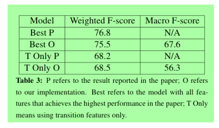
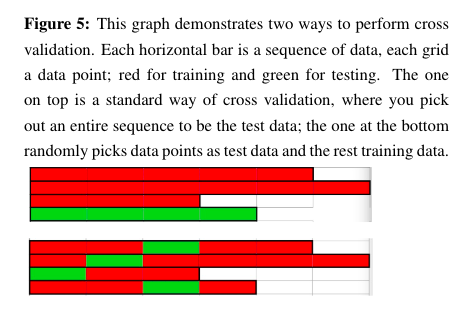

# EvolvingSocialNetwork6998

## Abstract:

We reproduced work from “Modeling Evolving Relationships Between Characters in Literary Novels” (Snigdha Chaturvedi, Shashank Srivastava, Hal Daume III, Chris Dyer (2016)). Though the heuristics features based on the dependency tree described in this paper sounds simple and convincing at the first glance, our implementation and error analysis demonstrates that these features need to be designed/described with more sophistication, or they become insufficient to tackle the task of targeted sentiment classification. Furthermore, we argue that macro-F score (as opposed to weighted F-score) and cross validation on random sequences (as opposed to random data points) are more meaningful evaluation metrics. Nevertheless, we find that one result in \cite{chaturvedi2016modeling} exceeds the theoretically best performance. This enable us to "reverse engineer" the actual metrics used by \cite{chaturvedi2016modeling} (which has not been verified by personal communication), and our implementation show a strong evidence that it is using weighted F-score and cross validation on individual data points.

## Evaluation of Our Results vs. Results in the Original Paper:
We use cross validation on individual data points rather than entire sequences, and report the weighted F-measure and macro F measure. 

We see that the result of our implementation based on weighted F-score is comparable to that reported in the paper, suggesting that the paper is also using weighted F-score; on the other hand, in both cases the macro-F score is significantly lower than the weighted one, since the classifier has a better performance on the positive class. Nevertheless, we also see a substantial improvement in macro-F score from the model that only consists of transition feature to that has all the sentence features. It indicates that the feature engineer is still successful that it can bring significant improvements over the baseline; it is only that both the scores of the best model and baseline reported are artificially higher than what "it should have been".

The original paper reports the F-measure on 10 fold cross validation. In this section we explain how readers usually interpret this metrics, whereas it is highly likely that the paper has a different meaning, which might be misleading. We also show that this metrics is not robust.

In such a sequence classification task, researchers usually pick entire sequences of data to be either training/testing set. Such an evaluation is more meaningful than randomly picking data points as training/testing set, since in real life we encounter entirely new sequences without any data points on it being labeled before hand. See visualization below.

While multiple classes are involved in an F-score, researchers usually mean "macro F-score" over different classes, meaning a simple average of the F-score of each class. Another interpretation might be weighted F-score, where the average F is weighted by the number of true instances for each class. However, under unbalanced setting, weighted F-score will give a better but less informative evaluation, since algorithms usually have higher F-scores on the dominating class, and giving them more weight leads to an artificially high performance, which prevents us from seeing its performance on classes that are underrepresented.

## Summary 

To summarize, we successfully reproduced the major results from \cite{chaturvedi2016modeling}. Reproducing the work allows us to examine some negative aspects of the pre-processing steps, feature engineering and evaluation metrics. 

The coreference resolution and character/entity identification problems are far from solved by the Natural Language Processing research community. It sheds light on the current limit of NLP research, that we are probably still not yet able to perform entity recognition in a robust fashion as we do for Dependency Parsing/POS tagging tasks. Therefore, any research based on existing "off-the-shelf" character identification tool should be subject to scrutiny. 

We also demonstrate several downfalls of the designed features in extracting the positive/negative relation between characters. It reveals that, even though the simple heuristics proposed by \cite{chaturvedi2016modeling} seem convincing at the first glance, they underestimate the complication of natural languages and are far from robust and effective. Targeted sentiment analysis is an ongoing research field \cite{mitchell2013open} and state-of-the-art uses much more sophisticated methods \cite{liu2017attention} \cite{li2017learning}.

At last, we explained the common interpretation towards the metrics (cross validation on sequences, macro F-score) described in the paper, versus what metrics the paper is more likely to be using (cross validation on data points, weighted F-score); this conjecture is corroborated by both a "theoretical" argument and our implementation. Also, due to scarcity of data and randomness of the algorithm, the inter-fold and intra-fold variances are large, making the performance unstable. However, such a fact would not be available to the reader if only the average is reported. Therefore, to fairly evaluate an algorithm, it is also worthwhile to also study and report its min/max/standard deviation. On the other hand, to avoid vagueness of what metrics the paper is using, we recommend researchers to document their evaluation procedure and the mathematical formula for the evaluation metrics in the appendix.

## Folder structure

Custom_Perceptron.py: implemented the perceptron algorithm

HMM.py: implemented decoding and training algorithm 

download_corpus.py: tool to scrape SparkNotes literature summaries

word_embedding.py: convert input texts to word embeddings

models/ houses the trained word to vec (w2v) files

corpus_data/ contains the file sparknotes.txt, or any file that you would like to train the word embeddings on.

compressed/ is an intermediate folder needed for generating framenet frames.

frames/ is an output folder to store the generated framenet xml.

