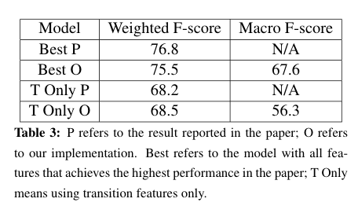

# EvolvingSocialNetwork6998

Custom_Perceptron.py: implemented the perceptron algorithm

HMM.py: implemented decoding and training algorithm 

download_corpus.py: tool to scrape SparkNotes literature summaries

word_embedding.py: convert input texts to word embeddings

## Summary:

We reproduced work from “Modeling Evolving Relationships Between Characters in Literary Novels” (Snigdha Chaturvedi, Shashank Srivastava, Hal Daume III, Chris Dyer (2016)). Though the heuristics features based on the dependency tree described in this paper sounds simple and convincing at the first glance, our implementation and error analysis demonstrates that these features need to be designed/described with more sophistication, or they become insufficient to tackle the task of targeted sentiment classification. Furthermore, we argue that macro-F score (as opposed to weighted F-score) and cross validation on random sequences (as opposed to random data points) are more meaningful evaluation metrics. Nevertheless, we find that one result in \cite{chaturvedi2016modeling} exceeds the theoretically best performance. This enable us to "reverse engineer" the actual metrics used by \cite{chaturvedi2016modeling} (which has not been verified by personal communication), and our implementation show a strong evidence that it is using weighted F-score and cross validation on individual data points.

## Evaluation of Our Model as Compared to Original:

